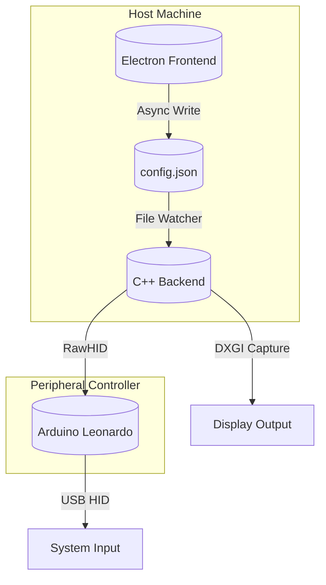

# Json's Colorbot

**Json's Colorbot** is a hybrid computer vision software suite designed for input simulation research. It utilizes a decoupled architecture where a high-level Electron interface communicates with a low-latency C++ backend via asynchronous file I/O, ensuring separation of concerns and modularity.

before anything else, this is a proof of concept for a research project. it is not intended to be used for any malicious purposes. do not trust pasters.

## Architecture

The system operates on an asynchronous producer-consumer model via the filesystem.



### Component Breakdown

1.  **Frontend (UI)**: An Electron-based GUI acting as the control plane. It serializes user preferences into a structured JSON configuration.
2.  **Configuration Interface**: `config.json` serves as the volatile state store. It acts as the synchronization primitive between the UI and the Backend.
3.  **Backend Core**: A standalone C++ executable.
    *   **Input**: Real-time screen capture via Desktop Duplication API (DXGI) or GDI (BitBlt).
    *   **Processing**: OpenCV string processing for color filtering and contour detection.
    *   **Output**: Sends normalized coordinate deltas to the hardware interface.
4.  **Hardware Interface (HID)**: An external microcontroller (Arduino Leonardo/Micro) spoofing a standard USB HID device (e.g., SteelSeries Rival 3). It receives raw data via a raw HID channel and executes physical mouse inputs, bypassing host-level software input hooks.

## Technology Stack

### Frontend Control Plane
*   **Runtime**: Electron (Chromium + Node.js)
*   **Framework**: React 19 + TypeScript
*   **Styling**: TailwindCSS v4 (Glassmorphism design system)
*   **State Management**: React Hooks + File System Watchers

### Backend Processing Unit
*   **Language**: C++17
*   **Computer Vision**: OpenCV 4.x
*   **Capture APIs**: DirectX Graphics Infrastructure (DXGI), GDI
*   **Concurrency**: `std::thread`, `std::filesystem` for hot-reloading configurations.

### Firmware & Hardware
*   **Platform**: AVR (ATmega32u4)
*   **Protocol**: RawHID (Bidirectional 64-byte packets)
*   **Spoofing**: USB Descriptor modification (VID/PID cloning) to emulate legitimate peripherals.

## Device Communication Flow

1.  **Initialization**: The C++ backend establishes a handle to the specific VID/PID of the microcontroller using `hidapi`.
2.  **Detection Loop**:
    *   Frame is captured and converted to HSV color space.
    *   Thresholding isolates target color ranges.
    *   Contours have their centroids calculated.
3.  **Vector Calculation**:
    *   Delta $( \Delta x, \Delta y )$ is calculated from the screen center to the target centroid.
    *   Smoothing algorithms (Exponential Moving Average) and randomization (Humanization) are applied.
4.  **Data Transmission**: The processed delta is packed into a raw byte buffer and sent to the MCU.
5.  **Execution**: The MCU receives the packet, interprets the signed bytes, and sends standard HID reports to the OS.

## Mouse Input Pipeline

The input simulation subsystem is designed to bypass standard kernel-level hook inspections (e.g., `SetWindowsHookEx`, `LowLevelMouseProc`) by offloading physical signal generation to an external micro-controller unit (MCU).

```mermaid
sequenceDiagram
    participant Cpp as C++ Backend
    participant Transport as Transport Layer
    participant MCU as Arduino MCU
    participant USB as USB HID Interface
    participant OS as Operating System

    Note over Cpp, OS: ~1-3ms End-to-End Latency

    Cpp->>Transport: Normalized Delta Vector (dx, dy)
    Transport->>MCU: Packet Transmission (RawHID / TCP)
    
    rect rgb(20, 20, 20)
        Note left of MCU: Firmware Processing
        MCU->>MCU: Parse Packet
        MCU->>MCU: Apply Gaussian Smoothing
        MCU->>MCU: Inject Micro-Tremors (Xorshift32)
    end
    
    MCU->>USB: Send HID Report
    USB->>OS: HW Interrupt
```



## Hardware-Level Stealth (Ethernet Variant)

For environments requiring **Air-Gapped** security, the system supports an Ethernet-based transport layer (`/arduino/colorbot_ethernet/`).

### Architecture
Instead of a direct USB connection for data (which can be enumerated), the MCU communicates via a W5500 Ethernet Shield over TCP/IP.

*   **Protocol**: TCP Sockets (Port 31337)
*   **Isolation**: The device appears to the host solely as a generic HID Mouse. No COM ports or Composite Devices are exposed.
*   **Packet Structure**: Plaintext `x,y` coordinates or `C` (Click) triggers, parsed by a custom command interpreter on the MCU.
*   **Humanization**:
    *   **Gaussian Delay**: Movement packets are processed with randomized delays based on a normal distribution.
    *   **Micro-Tremors**: A 32-bit Xorshift RNG injects sub-pixel noise to mimic biological hand instability.

### Advantages
1.  **No Driver/Serial Presence**: The host OS sees 0 non-HID traffic.
2.  **Network Transparency**: Detection requires Deep Packet Inspection (DPI) of the local network, which is out of scope for standard anti-cheat runtimes.

## Setup & Compilation

### Prerequisites
*   Node.js v20+
*   Visual Studio 2022 (C++ Desktop Development workload)
*   OpenCV 4.5+ (pre-built binaries)
*   Arduino IDE (with HID-Project library)

### 1. Firmware Flashing
Navigate to `/arduino/colorbot_rawhid/` and upload the sketch to your Leonardo. Ensure `boards.txt` has been modified to disable CDC (COM Port) for true HID stealth.

### 2. Backend Build
Open the solution in `src/` with Visual Studio.
*   Configuration: **Release**
*   Platform: **x64**
*   Build and move the output `.exe` to the root directory.

### 3. Frontend Initialization
```bash
cd ui
npm install
npm run electron:dev
```

## Configuration

The `config.json` structure supports nested profiles (`legit`, `semi`, `rage`) and global visual settings.

```json
{
  "profile": "legit",
  "legit": {
    "xSpeed": 0.15,
    "ySpeed": 0.15,
    "rcs": true,
    "humanize": true
  },
  "visuals": {
    "draw_fov": true
  }
}
```

**Note**: The system is designed for educational research into input simulation latency and detection vectors.
